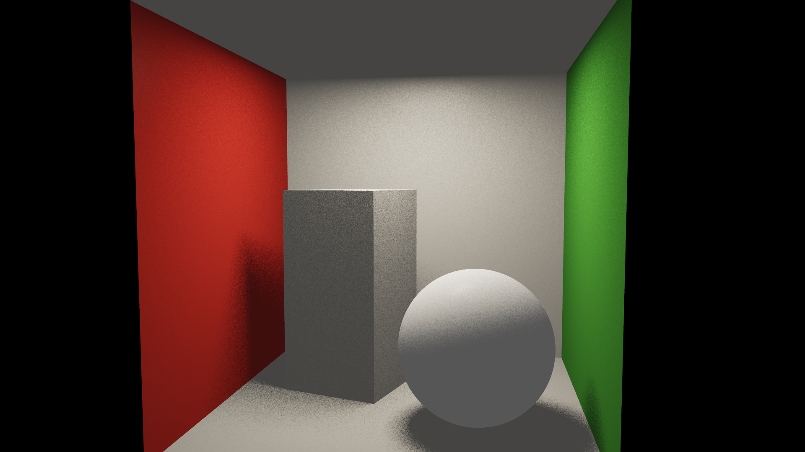
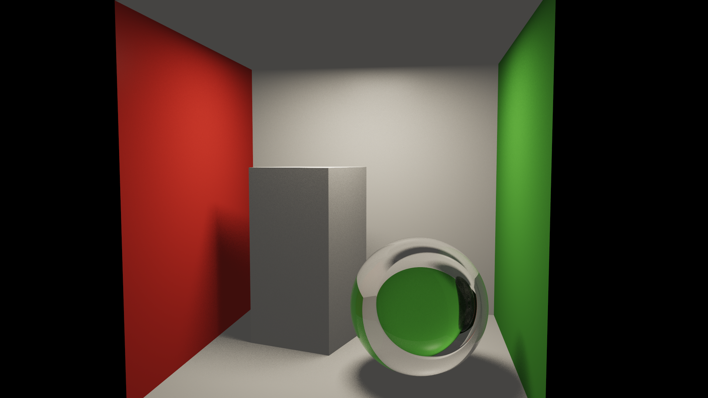
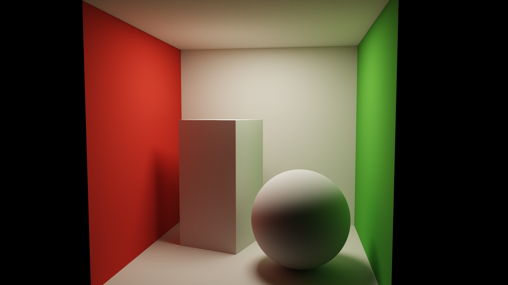
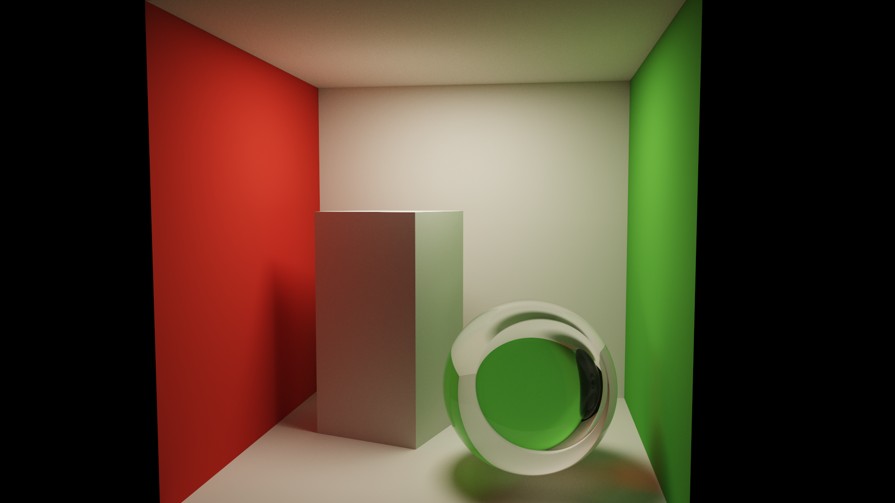
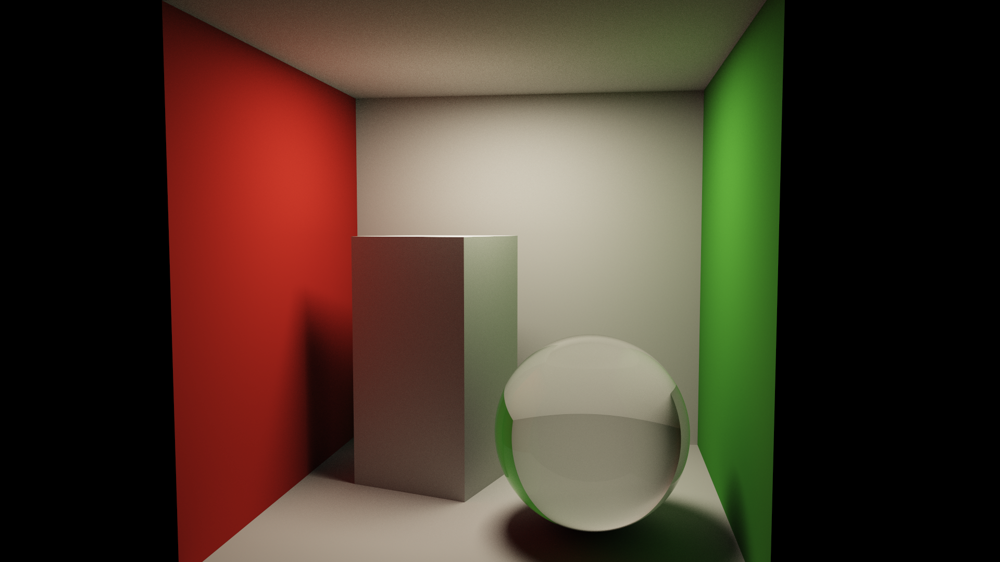
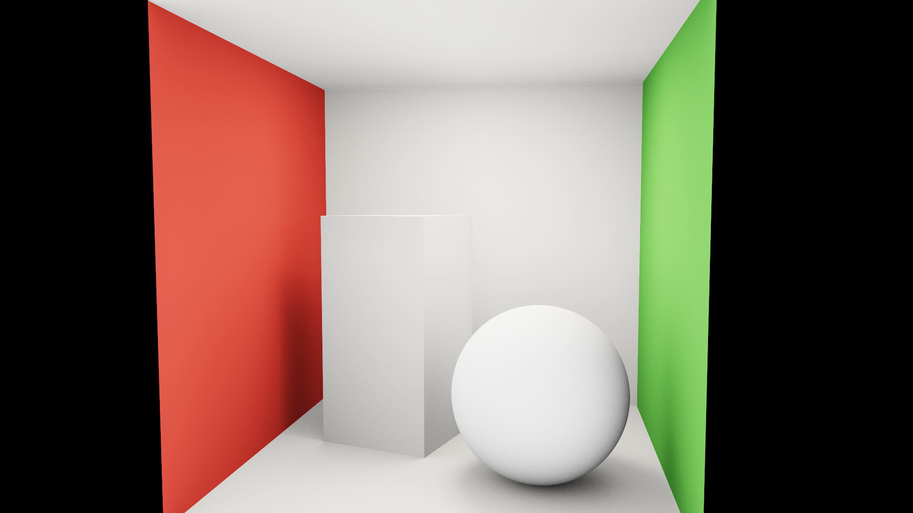
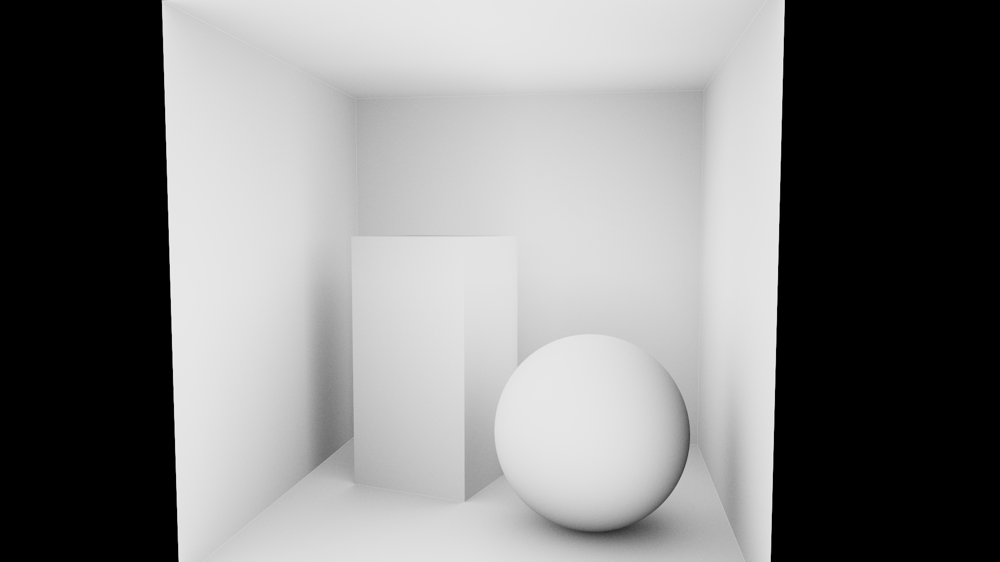

# Programa de Demostración: Caja de Cornell con Modelos Globales de Iluminación

**Implementación en C++ y OpenGL**

Documento técnico complementario del informe *Modelos Globales de Iluminación en
la Computación Gráfica*. Describe el diseño, la arquitectura y el uso del
programa de demostración que acompaña a la exposición oral. Sustituye al *Anexo:
Indicaciones para el Programa de Demostración* del informe, fijando como
plataforma **C++ + OpenGL** (decisión obligatoria del entregable).

---

## 1. Objetivo

El programa permite **comparar visualmente, sobre una misma escena (la caja de
Cornell), el comportamiento de los modelos de iluminación descritos en el
informe**, conmutando entre algoritmos en tiempo real y modificando sus
parámetros desde un menú. Cumple los requisitos del entregable:

- **Caja de Cornell** como escena de prueba estándar (informe §3.2, Anexo A.2).
- **Algoritmos del informe** implementados y seleccionables (§3.1–§3.5).
- **Menú** para modificar parámetros de cada técnica en vivo.
- **Resolución configurable hasta 1080p** (1920×1080).
- **C++ y OpenGL** de forma obligatoria.

A diferencia de usar un motor cerrado (Unity/Unreal), aquí *cada algoritmo está
escrito explícitamente*, de modo que la demostración enseña el funcionamiento
interno de cada método —no solo su efecto— que es el valor pedagógico buscado.

---

## 2. Resumen de lo entregado

| Elemento | Ubicación |
|---|---|
| Código C++ de la aplicación | `cornellbox/src/` |
| Shaders GLSL (algoritmos) | `cornellbox/shaders/` |
| Sistema de compilación (Makefile) | `cornellbox/Makefile` |
| Dependencias incluidas (Dear ImGui, stb) | `cornellbox/third_party/` |
| Figuras de comparación generadas | `cornellbox/capturas/` |
| Guía rápida | `cornellbox/README.md` |
| Este documento de diseño | `Implementacion_OpenGL_Cornell_Box.md` |

Los **seis algoritmos** implementados, con su correspondencia al informe:

| Modo | Algoritmo | Sección | Rasgo distintivo que demuestra |
|:---:|---|:---:|---|
| 0 | Iluminación local (Phong) | §2.1 | Directa “plana”, **sin** luz indirecta |
| 1 | Trazado de rayos (Whitted) | §3.1 | Reflejos/refracciones + sombras nítidas |
| 2 | Radiosidad (GI difusa) | §3.2 | **Sangrado de color** difuso, sin especular |
| 3 | Path tracing | §3.3 | Solución unificada; **ruido** que baja con las muestras |
| 4 | Mapeo de fotones | §3.4 | **Cáusticas** bajo el vidrio |
| 5 | Oclusión ambiental / GI tiempo real | §3.5 | Oscurecimiento de contacto, muy rápido |

El renderizado neuronal (§3.6) **no** se implementa: por definición se basa en
redes entrenadas a partir de fotografías (NeRF, *Gaussian splatting*) y no en
resolver la ecuación de renderizado, por lo que excede el alcance de un demo de
OpenGL escrito desde cero. En el panel se menciona como complemento, coherente
con lo expuesto en el informe.

---

## 3. Decisiones de arquitectura

### 3.1. ¿Por qué un *path tracer* en GPU (fragment shader)?

El entregable pide *“lo más eficiente sin perder calidad”* y *“representar de
manera fiel y notoria el cambio en la exposición”*. Eso descarta los
renderizadores en CPU (un path tracer/fotones en CPU tardaría segundos o minutos
por imagen a 1080p, impidiendo la comparación en vivo). La solución elegida es la
misma de los renderizadores interactivos de referencia (p. ej.
`yumcyaWiz/glsl330-cornellbox`):

> Toda la escena se evalúa en un **fragment shader** que se ejecuta una vez por
> píxel sobre un triángulo a pantalla completa. La GPU (NVIDIA GTX 1650, OpenGL
> 4.6) traza los rayos en paralelo, logrando **cientos de muestras por segundo a
> 720p–1080p**.

Esto permite cambiar de algoritmo, de escena o de parámetros y ver el resultado
**al instante**, que es justo lo que se necesita en una exposición.

### 3.2. Acumulación progresiva (clave de la calidad)

Los métodos de Monte Carlo (radiosidad, path tracing, fotones) producen ruido
que disminuye con el número de muestras (informe §3.3). Para no perder calidad se
usa **acumulación progresiva**:

- Existe un **acumulador HDR** (textura `RGBA32F`).
- Cada fotograma, el *trace pass* calcula unas pocas muestras nuevas (con
  *jitter* aleatorio) y las **suma** al acumulador mediante *blending* aditivo
  (`glBlendFunc(GL_ONE, GL_ONE)`). El canal alfa cuenta las muestras.
- El *present pass* divide por el número de muestras, aplica exposición, *tone
  mapping* (ACES) y gamma.
- Al mover la cámara o cambiar cualquier parámetro, el acumulador se reinicia.

Así el path tracing **converge ante los ojos del público**: empieza ruidoso y se
limpia en uno o dos segundos —exactamente la demostración del comportamiento del
ruido que pide el informe (Anexo A.4, Integrante 3). Para los algoritmos
deterministas (local, Whitted) la acumulación aporta *antialiasing* gratuito.

### 3.3. Tubería de render (tres pasadas)

```
                 ┌──────────────────────────────────────────────┐
   (solo modo 4) │ PASADA 0 · COMPUTE de fotones                │
                 │  photon.comp: emite fotones desde la luz,     │
                 │  los traza por vidrio/espejo y deposita los   │
                 │  fotones cáusticos en una imagen de cáusticas │
                 │  (sumas atómicas, r32ui)                      │
                 └───────────────┬──────────────────────────────┘
                                 │ textura de cáusticas
                 ┌───────────────▼──────────────────────────────┐
                 │ PASADA 1 · TRACE (fragment shader)            │
   cámara,  ───► │  trace.frag: 1..N muestras del algoritmo      │ ──► acumulador
   uniforms      │  activo; SUMA al acumulador (blend aditivo)   │      RGBA32F
                 └───────────────┬──────────────────────────────┘
                                 │ acumulador / nº muestras
                 ┌───────────────▼──────────────────────────────┐
                 │ PASADA 2 · PRESENT (fragment shader)          │
                 │  present.frag: promedia, exposición, ACES,    │ ──► pantalla
                 │  gamma; *letterbox* a la ventana              │      + menú ImGui
                 └──────────────────────────────────────────────┘
```

### 3.4. Pila tecnológica

| Componente | Elección | Motivo |
|---|---|---|
| Lenguaje | C++17 | Requisito del entregable |
| API gráfica | OpenGL 4.3 core (corre en 4.6) | Requisito; *compute shaders* para fotones |
| Ventana / contexto | GLFW 3.4 | Estándar, ligero |
| Carga de funciones GL | GLEW 2.3 | Disponible en el sistema |
| Interfaz / menú | Dear ImGui 1.91 | Menú inmediato, sin *boilerplate* |
| Captura PNG | stb_image_write | Cabecera única, sin dependencias |
| Compilación | GNU Make + pkg-config | `cmake` no es necesario |

> Nota sobre Wayland: GLEW usa GLX, por lo que el programa solicita el backend
> **X11** de GLFW (`GLFW_PLATFORM_X11`); funciona sobre XWayland sin cambios.

---

## 4. La escena: caja de Cornell

La sala es el cubo `[-1, 1]³` con la cara frontal abierta (por donde mira la
cámara). Geometría e intersecciones están en `shaders/scene.glsl`.

- **Paredes:** izquierda **roja**, derecha **verde**, suelo/techo/fondo
  **blancos** (colores saturados clásicos para evidenciar el sangrado de color).
- **Luz de área** rectangular en el techo (emisor difuso): produce sombras
  suaves y se muestrea por *next event estimation*.
- **Objetos** (intersección analítica de esferas y cajas orientadas):
  caja alta difusa, **esfera de vidrio** (dieléctrico, IOR ajustable) y
  **esfera espejo**.

Cuatro **escenas/preajustes** seleccionables en el menú, pensados para lucir
distintos efectos:

| Escena | Contenido | Para qué luce |
|:---:|---|---|
| 0 | Clásica (2 cajas difusas) | Sangrado de color y sombras suaves “de libro” |
| 1 | Caja difusa + esfera de vidrio | **Cáusticas** y refracción (ideal para fotones) |
| 2 | Vidrio + espejo | Reflexión especular + refracción (Whitted) |
| 3 | Completa (caja + vidrio + espejo) | Todos los efectos a la vez (por defecto) |

**Materiales** soportados: difuso (Lambert), espejo perfecto, dieléctrico
(Fresnel de Schlick + reflexión total interna) y emisor. La BRDF difusa y el
muestreo por coseno implementan el término de la ecuación de renderizado del
informe (§2.2).

---

## 5. Los algoritmos, uno a uno

Para cada modo se indica: la sección del informe, qué hace, **cómo está
implementado** (archivo y función) y qué efecto debe observarse. El código de
sombreado está en `shaders/trace.frag`.

### 5.1. Iluminación local — Phong (modo 0, informe §2.1)

- **Qué hace:** colorea cada superficie con luz **directa** únicamente: término
  ambiente constante + difuso (Lambert) + especular (Phong), con sombra dura
  opcional. No hay rebotes ni luz indirecta.
- **Implementación:** `shadeLocal()` → `directPhong()`. El espejo y el vidrio se
  sombrean como plástico (la local no sabe reflejar/refractar), lo que **hace
  evidente la limitación** del modelo.
- **Se observa:** imagen plana, esfera de vidrio “opaca”, ausencia de sangrado de
  color. Es la línea base contra la que se comparan los demás.



### 5.2. Trazado de rayos de Whitted (modo 1, informe §3.1)

- **Qué hace:** traza rayos desde la cámara y, recursivamente, rayos de
  **reflexión** y **refracción** en superficies especulares, además de **rayos de
  sombra** hacia la luz. Las superficies difusas se sombrean con Phong directo y
  terminan la recursión (Whitted clásico no calcula interreflexión difusa).
- **Implementación:** `shadeWhitted()`, bucle iterativo (GLSL no admite
  recursión) con `uMaxBounces` niveles. El dieléctrico usa `scatterDielectric()`
  con elección estocástica reflexión/refracción según Fresnel; al acumular
  muchas muestras, converge al resultado de trazar ambos rayos.
- **Se observa:** la esfera de vidrio **refracta** y el espejo **refleja**, con
  sombras nítidas; **pero** la caja sigue gris (sin sangrado de color): el rasgo
  que distingue a Whitted del path tracing.



### 5.3. Radiosidad — iluminación global difusa (modo 2, informe §3.2)

- **Qué hace:** calcula la **interreflexión difusa** entre superficies (la luz
  que rebota de pared a pared), produciendo sangrado de color y sombras suaves,
  como la radiosidad clásica. La radiosidad clásica resuelve un sistema de
  factores de forma entre parches lambertianos; aquí se obtiene **la misma
  solución de energía difusa** por integración de Monte Carlo, tratando *todas*
  las superficies como lambertianas.
- **Implementación:** `shadePath(..., forceDiffuse=true)`: se ignora el carácter
  especular (vidrio/espejo se vuelven difusos), de modo que solo queda transporte
  difuso. Usa NEE + muestreo por coseno + acumulación.
- **Se observa:** fuerte **sangrado de color** (la caja y la esfera se tiñen de
  rojo/verde), sombras suaves y **ausencia de reflejos**: la esfera de vidrio se
  ve como una bola difusa. Es justo el comportamiento característico de la
  radiosidad (solo difusa, independiente de la vista).

> **¿Por qué la radiosidad no refleja en el vidrio/espejo y el trazado de rayos
> sí? (no es un error, es el algoritmo).** La radiosidad parte de una hipótesis
> fundamental: **todas las superficies son difusas (lambertianas)**, es decir,
> reflejan la luz por igual en todas las direcciones. Bajo esa hipótesis, la
> radiancia que sale de un punto **no depende de la dirección de observación**,
> lo que permite resolver el intercambio de energía con factores de forma
> independientes de la vista (informe §3.2). Pero los reflejos especulares y las
> refracciones son, por naturaleza, **dependientes de la dirección** (lo que ves
> en un espejo cambia según dónde estés), así que **quedan fuera del modelo**: la
> propia definición de radiosidad no puede representarlos. El informe lo recoge en
> sus *Debilidades*: «Solo modela la reflexión difusa, por lo que no representa
> reflejos especulares ni refracciones y debe combinarse con otras técnicas». El
> trazado de rayos (Whitted) y el path tracing **sí** tratan materiales
> especulares/dieléctricos —trazan rayos de reflexión y refracción—, por eso en
> esos modos el vidrio refracta y el espejo refleja. En el programa esto se hace
> explícito: el modo radiosidad **convierte a propósito** el vidrio y el espejo en
> superficies difusas para mostrar fielmente lo que esta técnica puede y no puede
> capturar.

- *Nota de honestidad:* no se implementa el método de **elementos finitos** con
  factores de forma; se calcula su misma solución difusa por Monte Carlo, lo que
  es visualmente equivalente y más simple de integrar en la misma tubería.



### 5.4. Path tracing (modo 3, informe §3.3)

- **Qué hace:** resuelve la **ecuación de renderizado** completa por Monte Carlo:
  en cada rebote muestrea una dirección y construye trayectorias cámara→luz a
  través de rebotes difusos y especulares. Captura en un único marco sombras
  suaves, sangrado, reflejos, refracciones y cáusticas (estas últimas, con ruido).
- **Implementación:** `shadePath(..., forceDiffuse=false)` con las técnicas de
  reducción de varianza del informe (§3.3):
  - **Next Event Estimation** (`directDiffuse()`): conecta cada vértice difuso
    con la luz de área en lugar de esperar a alcanzarla por azar.
  - **Muestreo por importancia** coseno para el difuso.
  - **Ruleta rusa** para terminar trayectorias poco influyentes sin sesgo.
  - **Recorte anti-*firefly*** opcional.
- **Se observa:** la imagen físicamente más correcta; arranca **ruidosa** y se
  **limpia progresivamente** al acumular muestras (mostrar el contador en vivo).



### 5.5. Mapeo de fotones — cáusticas (modo 4, informe §3.4)

- **Qué hace:** método de **dos pasadas**. (1) Se **emiten fotones** desde la luz
  y se trazan por la escena; los fotones que atraviesan el vidrio o rebotan en el
  espejo antes de caer en el suelo difuso (fotones **cáusticos**) se almacenan en
  un *mapa de fotones*. (2) Al renderizar, la radiancia en el suelo se estima a
  partir de la densidad de fotones cercanos.
- **Implementación:**
  - Pasada de cómputo `shaders/photon.comp` (un hilo por fotón): traza el fotón y,
    al depositarse, hace **sumas atómicas** (`imageAtomicAdd`) con un *kernel*
    gaussiano sobre una **imagen de cáusticas** (`r32ui`, 512×512, parametrizada
    sobre el suelo). Es la estimación de densidad por *splatting*.
  - El sombreado `shadePhoton()` traza el rayo de cámara con comportamiento
    especular completo (el vidrio/espejo se ven correctos) y, en las superficies
    difusas, suma **luz directa + cáusticas del mapa + rebotes difusos limitados**
    (*final gather*) para el sangrado de color.
  - Cada fotograma usa una semilla distinta; la acumulación de la imagen final
    limpia el ruido (análogo al *progressive photon mapping* del informe).
- **Se observa:** una **cáustica** brillante concentrada en el suelo bajo la
  esfera de vidrio —dentro de la zona que de otro modo estaría en sombra—, con
  mucho menos ruido que en el path tracing puro. Controlable con *Ganancia de
  cáusticas* y *Fotones/frame*.
- *Nota de honestidad:* es un mapa de fotones **de cáusticas** con estimación de
  densidad en espacio de textura del suelo (no un *kd-tree* general en 3D). Es la
  variante adecuada para mostrar el efecto que motiva el método.



### 5.6. Oclusión ambiental / GI en tiempo real (modo 5, informe §3.5)

**Idea en una frase:** en lugar de *calcular* la luz indirecta (cara), la finge
**oscureciendo los rincones**. La intuición física: una esquina, una grieta o la
base de un objeto reciben menos luz rebotada porque la geometría que tienen
alrededor les *tapa* parte del cielo. La oclusión ambiental mide exactamente eso
—**cuán “tapado” está cada punto**— y lo usa para ensombrecer, imitando el aspecto
de la luz indirecta a un coste mínimo. Es la base de la SSAO omnipresente en los
videojuegos (informe §3.5).

- **Qué hace, paso a paso:** para cada punto visible se lanzan unos pocos rayos
  cortos (de longitud `radio AO`) repartidos por el hemisferio sobre la
  superficie. Se cuenta qué fracción de esos rayos **no** choca con nada cercano:
  - punto en campo abierto (centro de una pared) → casi ningún rayo choca →
    **factor AO ≈ 1** (claro);
  - punto en una esquina o donde la esfera toca el suelo → muchos rayos chocan con
    la geometría vecina → **factor AO ≈ 0** (oscuro).
- **Implementación:** `shadeAO()` en `trace.frag`. El factor AO modula un término
  de luz **ambiente** que se suma a la luz directa. Es muy barato y, con la
  acumulación progresiva, queda sin ruido en una fracción de segundo. **No** hay
  transporte de luz real: ni color sangrado, ni reflejos, ni cáusticas.

**Por qué “no se entendía a la vista” y cómo verlo claro.** En la vista combinada
el efecto es sutil: como la caja de Cornell tiene una luz potente, la luz
**directa** domina y el oscurecimiento del AO se aprecia poco (solo se nota un
ligero sombreado en esquinas y contactos). Por eso el programa incluye un
selector **“Visualización”** en el panel del modo 5:

- **Combinada (luz + AO):** el render normal, donde el AO solo añade ese matiz de
  sombreado de contacto sobre la iluminación directa.
- **Solo oclusión (grises):** muestra **únicamente el factor AO** en blanco y
  negro. Aquí se ve sin lugar a dudas qué hace el algoritmo: las superficies
  abiertas salen blancas y los rincones, aristas y contactos salen oscuros. **Para
  la exposición, mostrar primero esta vista** y luego la combinada deja clarísimo
  el concepto.

- **Se observa:** comparado con el path tracing, el AO produce una imagen mucho
  más plana (sin sangrado de color ni reflejos), pero con un **oscurecimiento de
  contacto** convincente y casi gratis. Representa el compromiso
  *calidad/velocidad* de las aproximaciones en tiempo real del informe.

| Combinada (luz directa + AO) | Solo oclusión (factor AO en grises) |
|:---:|:---:|
|  |  |

---

## 6. El menú y los controles

El panel (Dear ImGui) agrupa los parámetros “pequeños pero suficientes” para la
demostración:

- **Algoritmo:** selector de los 6 modos.
- **Escena y resolución:** 4 preajustes de escena; resolución
  `360p / 540p / 720p / 900p / 1080p`.
- **Muestreo:** muestras por fotograma, rebotes máximos, ruleta rusa, sombras
  suaves/duras, recorte anti-*firefly*.
- **Phong (modos 0–1):** ambiente, especular `ks`, brillo (*shininess*).
- **Oclusión ambiental (modo 5):** **visualización** (combinada / solo oclusión en
  grises), nº de muestras, radio, intensidad ambiente.
- **Mapeo de fotones (modo 4):** fotones por fotograma, rebotes difusos (*final
  gather*), ganancia de cáusticas.
- **Luz y materiales:** color e intensidad de la luz, tamaño de la luz de área,
  IOR del vidrio, tinte de las paredes.
- **Imagen:** exposición, *tone mapping* (Ninguno/Reinhard/ACES), gamma, VSync.
- **Acciones:** reiniciar acumulación, **guardar captura PNG**, resetear cámara.
- **Métricas:** resolución de render, **muestras acumuladas**, **ms/frame y FPS**.

**Cámara:** orbital. Arrastrar con el ratón orbita; la rueda acerca/aleja.
Cualquier cambio reinicia la acumulación automáticamente.

---

## 7. Compilación y ejecución

Dear ImGui y `stb_image_write.h` ya vienen en `third_party/`, así que no hay que
descargar nada más. El `Makefile` **detecta el sistema operativo** y ajusta las
bibliotecas a enlazar. Instrucciones detalladas (incluido Visual Studio) en
`cornellbox/README.md`.

### Linux (CachyOS / Arch — probado)

```sh
# 1. Dependencias del sistema
sudo pacman -S --needed glfw glew mesa gcc make      # Arch / CachyOS
# (Ubuntu/Debian: build-essential libglfw3-dev libglew-dev libgl1-mesa-dev)

# 2. Compilar y ejecutar
cd cornellbox
make
./cornellbox        #  o:  make run
```

Probado con g++ 16, GLFW 3.4, GLEW 2.3, OpenGL 4.6 (NVIDIA GTX 1650).

### Windows (MSYS2 / MinGW-w64 — reutiliza el mismo Makefile)

1. Instalar [MSYS2](https://www.msys2.org/) y abrir la terminal **“MSYS2 MinGW x64”**.
2. Dependencias:
   ```sh
   pacman -S --needed mingw-w64-x86_64-gcc mingw-w64-x86_64-make \
     mingw-w64-x86_64-pkgconf mingw-w64-x86_64-glfw mingw-w64-x86_64-glew
   ```
3. Compilar y ejecutar:
   ```sh
   cd cornellbox
   mingw32-make            # genera cornellbox.exe
   ./cornellbox.exe        # o:  mingw32-make run
   ```

> El `Makefile` enlaza `-lopengl32 -lgdi32` en Windows en lugar de `-lGL -lX11`,
> y produce `cornellbox.exe`. La alternativa **Visual Studio + vcpkg**
> (`vcpkg install glfw3 glew`) está descrita paso a paso en el README.

---

## 8. Modo headless: figuras y métricas para el informe

Para generar capturas reproducibles sin abrir ventana (útil para las figuras del
informe y para la tabla de métricas del Anexo A.5):

```sh
# ./cornellbox --render <modo> <escena> <spp/frame> <frames> <resIdx> [salida.png]
./cornellbox --render 3 3 4 200 4 path_1080p.png   # path tracing 1080p, 800 spp
./cornellbox --render 4 1 2 220 2 causticas.png    # fotones, escena con vidrio, 720p
```

Imprime el **tiempo total de render**, la **resolución** y las **muestras**
acumuladas, que es lo que pide registrar el Anexo A.5 del informe (tiempo por
imagen, muestras/fotones para una imagen limpia, ms/frame). Las figuras de la
sección 5 de este documento se generaron así (carpeta `cornellbox/capturas/`).

**Métricas de referencia medidas** (GTX 1650, escena completa, 720p):

| Modo | Coste por muestra | Notas |
|---|---|---|
| Local / AO | ~0.5–1 ms | Tiempo real holgado |
| Whitted | ~0.7 ms | Tiempo real |
| Radiosidad / Path tracing | ~1.2 ms/muestra | ~1 s para 800 spp (imagen limpia) |
| Fotones | ~0.9 ms (incluye 200k fotones) | Cáustica limpia en pocas décimas de s |

---

## 9. Estructura de archivos

```
cornellbox/
├── Makefile                 · compilación (make / make run)
├── README.md                · guía rápida
├── compile_commands.json    · para el autocompletado del editor
├── src/
│   ├── main.cpp             · ventana, FBOs, 3 pasadas, cámara, menú ImGui, capturas
│   ├── shader.h             · carga/compila shaders + #include de GLSL
│   └── mathx.h              · vectores y cámara orbital (sin GLM)
├── shaders/
│   ├── fullscreen.vert      · triángulo a pantalla completa
│   ├── common.glsl          · RNG, muestreo, Fresnel, dieléctrico (compartido)
│   ├── scene.glsl           · geometría de la caja de Cornell e intersecciones
│   ├── trace.frag           · los 6 algoritmos
│   ├── photon.comp          · pasada de fotones (cáusticas)
│   └── present.frag         · exposición + tone mapping + gamma
├── third_party/             · Dear ImGui + stb_image_write (incluidos)
└── capturas/                · figuras de comparación generadas
```

---

## 10. Correspondencia con el informe y reparto por integrantes

Siguiendo la distribución de la Tabla 1 y las sugerencias del Anexo A.4 del
informe, cada bloque temático tiene su correlato en el programa:

| Integrante | Tema (informe) | Qué demostrar en el programa |
|---|---|---|
| 1 | Local vs. global; ecuación de renderizado (§2) | Alternar **modo 0 (local)** ↔ **modo 3 (path)**: aparece la luz indirecta |
| 2 | Trazado de rayos; radiosidad (§3.1–3.2) | **Modo 1 (Whitted)** reflejos/refracción; **modo 2 (radiosidad)** sangrado de color |
| 3 | Path tracing; mapeo de fotones (§3.3–3.4) | **Modo 3** subiendo muestras (baja el ruido); **modo 4** cáusticas |
| 4 | GI en tiempo real; comparación (§3.5, §4) | **Modo 5 (AO)** y panel de **métricas (FPS/ms/muestras)** |

---

## 11. Recomendaciones para la demostración en vivo (Anexo A.6)

- Empezar en **modo 0 (local)** y pasar a **modo 3 (path tracing)** sobre la misma
  escena: el “antes y después” de la iluminación global es inmediato y notorio.
- Para el ruido (Integrante 3): poner *muestras/frame* en 1 y pulsar *Reiniciar
  acumulación*; el público ve la imagen limpiarse sola en segundos.
- Para cáusticas: usar la **escena 1** (caja + vidrio) y el **modo 4**; subir
  *Ganancia de cáusticas* si se quiere enfatizar.
- Tener listas las **capturas PNG** (`capturas/`) como respaldo por si falla el
  render en vivo, tal y como aconseja el informe.

---

## 12. Repositorios de referencia consultados

Tomados como ejemplo de estructura y enfoque (no copiados):

- `yumcyaWiz/glsl330-cornellbox` — path tracer de la caja de Cornell en un
  fragment shader GLSL (inspiró la arquitectura en GPU con acumulación).
- `LucasReSilva/Cornell-Box` — caja de Cornell con OpenGL.
- `cvryn7/Cornell-Box-Photon-Mapping` — mapeo de fotones sobre la caja de Cornell.
